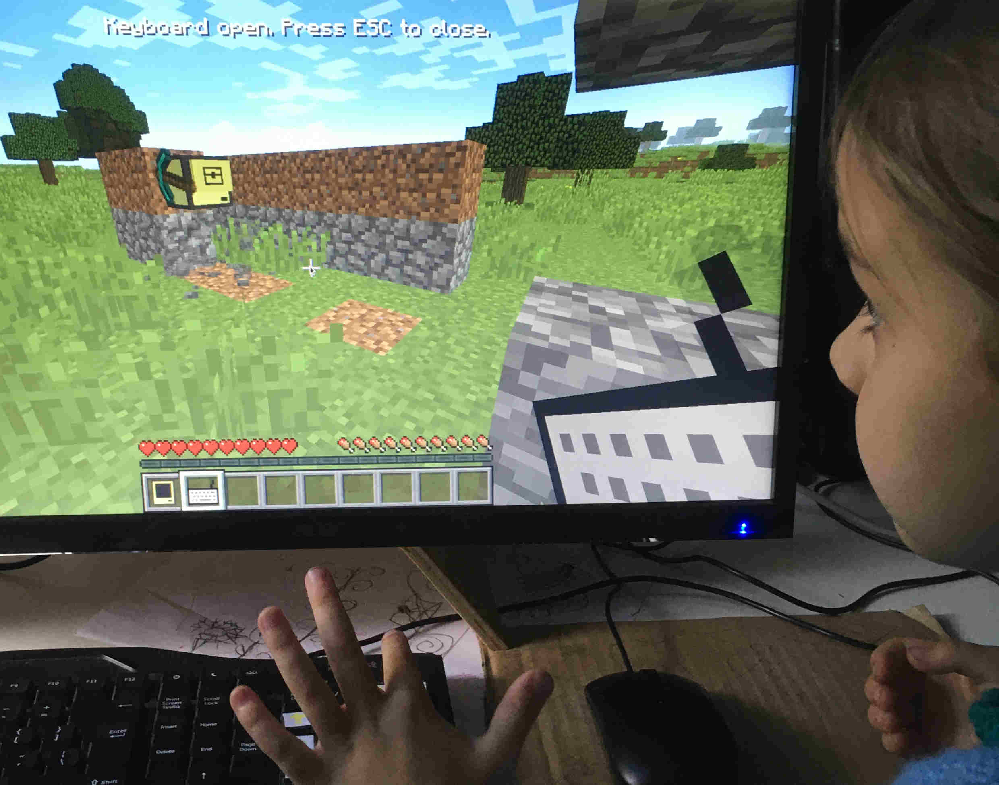
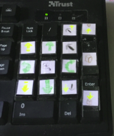

# DoBots - Learning to program before you can read

The foundations of programming can be taught to children before they are able to read and write, by representing every concept they need with a symbol and tasking them to use it.
This project should help you to teach children aged 3-6 how to plan sequential actions in the cubicle world of Minecraft.



This is a collection of lua code that helps you to teach programming to children using turtles in the ComputerCraft Minecraft Mod.
I stuck the children's drawings on the numpad keys that are used in `move`; if pressed the turtle will do these actions immediately.



Note I don't have loop and end loop key stickers yet, for the 0 and . keys. If you want to make a printable design, I would welcome a Pull Request.

## Controls

These are the turtle controls, mapped to the numpad keys.
You should consistently refer to the keys by their right names to make it easier to transition
to text-based programming later with [AdaBots](http://github.com/TamaMcGlinn/AdaBots):

```
7       Up
8       Forward
*       Dig Up
-       Place Up
9       Dig
+       Place
4       Turn Left
5       Select
6       Turn Right
1       Down
2       Back
3       Dig Down
[enter] Place Down
0       Loop
.       End Loop
```

## Install instructions (minecraft)

On the minecraft side of things, you need the following one-time setup:

1) Choose latest versions of the following that work together

Currently that is Minecraft and
[Minecraft Forge 1.12.2](https://files.minecraftforge.net/net/minecraftforge/forge/index_1.12.2.html)
with [CC:Tweaked 1.89.1](https://www.curseforge.com/minecraft/mc-mods/cc-tweaked/files)
and [Plethora 1.12.2](https://plethora.madefor.cc/).

2) Install [minecraft](https://minecraft.net/)

You will need to purchase the game.

3) Install [minecraft forge](https://files.minecraftforge.net/net/minecraftforge/forge/)

Download the installer for your operating system and minecraft version. Run it:

- on linux, issue `java -jar ~/Downloads/forge-*.jar` on the terminal
- on windows or mac, double-click the jar file

Select the forge game version in the launcher and press play, letting it load until you
are presented with the main game menu.

4) Install [CC:Tweaked](https://www.curseforge.com/minecraft/mc-mods/cc-tweaked) and [Plethora](https://plethora.madefor.cc/)

The minecraft directory is 

- Windows => %appdata%\.minecraft\
- Mac     => ~/Library/Application Support/minecraft/
- Linux   => ~/.minecraft/

It contains mods/, and you should put the cc-tweaked and plethora .jar files in there and restart.

5) Give yourself a turtle in-game

I recommend you create a survival mode world *set to peaceful* with cheats enabled. 
You may also with to enter these commands in-game to avoid distractions:

```
/gamerule doDayNightCycle off
/time set day
/weather off
/weather clear
```

With cheats enabled, you can type `/give [yourname] computercraft:turtle_normal` (with tab-completion).
Place it and right click it to open an in-game terminal on the turtle. Issue this command to give
the turtle a name, and also to create the turtle's program directory:

```
label set [name]
```

6) Copy (or symlink) lua/move onto the turtle

In the minecraft directory, under saves/[save_name]/computercraft/computer/ there is a numbered
directory for every turtle in computercraft. You can copy lua/move into that directory:

```
cp lua/move ~/.minecraft/saves/DoBots_MC1_12_2/computer/0/
```

and then issue `move` on the turtle's terminal. It will start reponding to keypad presses,
but only while the terminal is blocking your screen.

7) Connect [a keyboard](https://plethora.madefor.cc/items/keyboard.html) for remote control

This is where the need for Plethora arises. Give yourself a keyboard and right-click to start 
using it. Now you can issue commands without blocking your screen with the terminal.

```
/give [yourname] plethora:keyboard
```

Press shift-rightclick when looking at the turtle to connect it.

8) Optional: configure computercraft to not require fuel

Initially, only turning the turtle will work. That's because all other commands require energy.
You could refuel the turtle manually, but it is rather tedious as there's no numpad button currently
bound to the refuel command. I recommend to leave fuel-considerations for later.

Instead, you can edit the computercraft config file in `config/computercraft.cfg` your minecraft folder:

```
    # Set whether Turtles require fuel to move
    B:need_fuel=false
```

### First steps

The first step in programming is learning to imagine and then describe what you want done, so practice first moving the turtle around and digging or placing blocks.
Have the child build something, or dig some things out 'by hand' first.
Next, introduce the loop concept to move the turtle to a far place; typing a number and then pressing an action will do the action that many times.

### Loops

Use the square brackets to put together multiple actions in sequence. For instance, `5[up,forward]` will go up and then forward five times.
Explain the need to group these so that the robot knows when you are done with the loop contents; the next program `5[up,forward,placeDown]` illustrates the point. Construct the four walls of a house with a nested loop - put the turtle one block above the ground surface, with some building materials selected, and do `4[10[placeUp,placeDown,back]turn]`.

## Limitations

You can't see the program while it is being constructed. A good option would be to draw the program with the child on paper prior to typing it in.
In fact, you may want to key in the program for the child, to avoid typo-toddler-frustration.

It is not possible to read anything about the environment. For instance, it's not possible to have the robot "go down until the floor".
I didn't find this to be a problem, because by the time your child is ready for this, he/she should probably be able to read, and hence is ready
for [AdaBots](http://github.com/TamaMcGlinn/AdaBots), which supports a real-world programming language.

